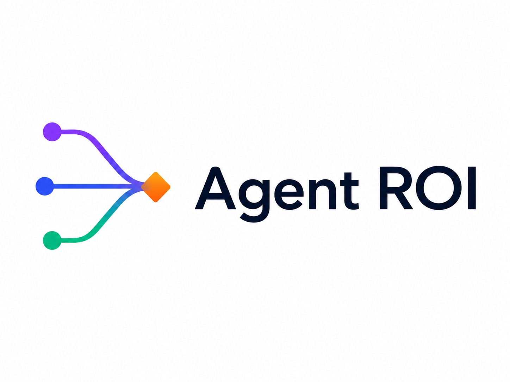
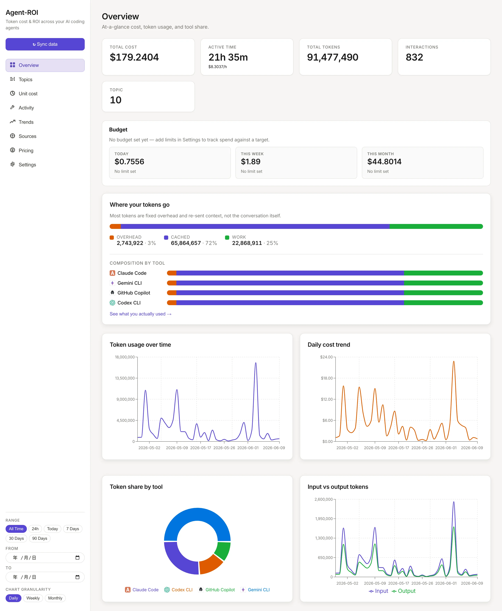
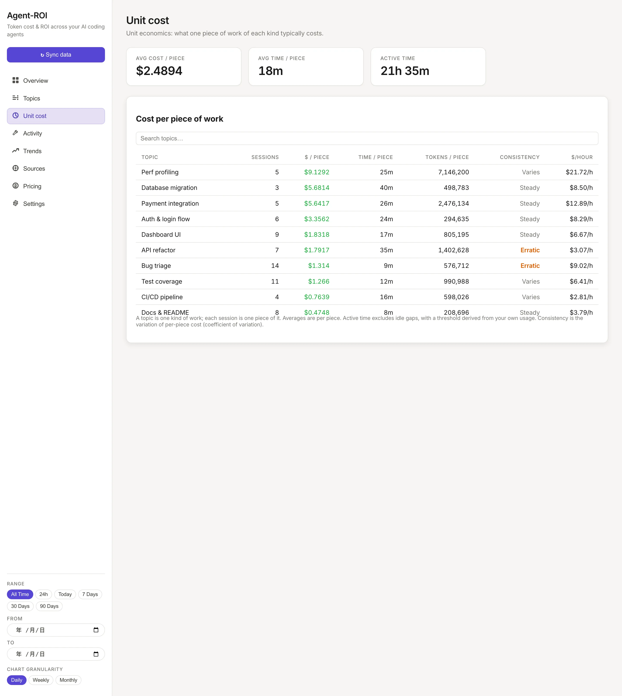

<div align="center">



# Agent-ROI

**追蹤你的 AI coding agent 的花費、用量與 ROI — 跨越每一個工具。**

[](https://github.com/Agent-ROI/agent-roi/actions/workflows/ci.yml)
[](https://pypi.org/project/agent-roi-tracker/)
[](https://www.python.org/downloads/)
[](LICENSE)

[English](./README.md) · [繁體中文](./README.zh.md)

</div>

---

當你同時使用多個 AI coding 工具 — Claude Code、Codex CLI、GitHub Copilot、Cursor、Gemini CLI — token 花費四散各處、難以評估。**Agent-ROI** 讀取每個工具本來就會寫下的本地 session log，使用**免模型的語意分類器**自動歸納**主題／任務**，接著呈現每個主題消耗了多少 token。

> *「為了這個功能／bug 修正／主題，我的 agent 燒了多少 token — 值得嗎？」*

<div align="center">



<sub>總覽：token 與金錢花在哪，以及你實際花了多久。</sub>

<br /><br />



<sub>單位成本：每一類工作平均完成一件要花多少 — 以及穩不穩定。</sub>

</div>

## 安裝

**macOS / Linux / WSL：**

```bash
curl -LsSf https://raw.githubusercontent.com/Agent-ROI/agent-roi/main/scripts/install.sh | sh
```

**Windows（PowerShell）：**

```powershell
irm https://raw.githubusercontent.com/Agent-ROI/agent-roi/main/scripts/install.ps1 | iex
```

需要時會自動安裝 `uv`，接著安裝 `agent-roi` 指令，不需管理 Python 版本。

<details>
<summary>其他安裝方式</summary>

```bash
pipx install agent-roi-tracker
# 或
uv tool install agent-roi-tracker
```

執行安裝腳本前設定 `AGENT_ROI_FROM_GIT=1` 可從最新原始碼安裝。

</details>

## 快速開始

```bash
agent-roi ingest                          # 從所有偵測到的工具匯入 log
agent-roi report --by topic --since 7d   # 本週各主題成本
agent-roi roi --since 7d                  # 各主題的成本 vs 實際開發時間
agent-roi serve                           # 開啟 http://127.0.0.1:8000 Web 儀表板
agent-roi doctor                          # 查看哪些工具被偵測到及原因
agent-roi mcp-cost                        # 估算每個 MCP server 每輪的固定開銷
```

## 功能特色

| | |
|---|---|
| **工具無關** | 讀取 Claude Code、Codex CLI、GitHub Copilot、Gemini CLI 與 Hermes Agent 的本地 log — 不需 proxy、不改變使用流程 |
| **主題分類** | 免模型 TF-IDF + 餘弦相似度分群；完全離線、不花費 token、無需任何外部服務 |
| **花費與 ROI** | token 用量對應到各模型定價，可依**主題、工具或模型**彙總，並套用任意時間區間 |
| **不只看成本，也看時間** | 估算每個主題／session 的**實際開發時間**（回合間隔加總，並以由你自身使用習慣推導的閾值排除閒置區段——非固定魔術數字），讓成本能對照投入時間，並算出**每小時花費**速率。`agent-roi roi` 依此排名各主題並標出燒錢最兇者 |
| **權杖花在哪** | 把每筆總量拆成**固定開銷**（系統提示 + 工具 + MCP schema）、**快取重送**的上下文、與實際**對話**，讓你看清 token 真正花在哪 |
| **活動分析** | 成本背後的具體動作：呼叫了哪些工具與 **MCP server**、各幾次、各回傳多少 token、以及最常存取哪些檔案 |
| **MCP 成本** | `agent-roi mcp-cost` 估算每個 MCP server 每輪的 schema 固定開銷（opt-in；會啟動 server 讀取工具列表）|
| **下鑽分析** | 點任一主題即可看到各工具與模型的貢獻；估算值與精算值以標章清楚區分 |
| **Local-first** | 所有資料存在一個 SQLite 檔案；資料永不離開你的機器 |

## 支援工具

| 工具 | 狀態 |
|------|------|
| Claude Code | ✅ |
| Codex CLI | ✅ |
| GitHub Copilot | ✅ |
| Gemini CLI | ✅ |
| Hermes Agent | ✅ |
| Cursor | 🔜 |

## 架構

```
採集器 ──▶ 儲存層 ──▶ 分類器 ──▶ 儲存層 ──▶ CLI / API / Web
(解析 log)  (SQLite)  (語意分群)  (主題)
```

CLI（`typer`）與 REST API（`fastapi`）都是 `Service` 類別的薄層包裝。
詳見 [docs/architecture.zh.md](./docs/architecture.zh.md)。

## 設定

`~/.config/agent-roi/config.toml`（所有欄位選填 — 零設定即可使用）：

```toml
[classifier]
similarity_threshold = 0.18   # 越高 = 主題越多、越細
label_terms = 3

[collectors]
enabled = ["claude_code", "codex", "copilot", "gemini", "hermes"]
```

詳見 [docs/configuration.zh.md](./docs/configuration.zh.md)。

## 文件

| | English | 繁體中文 |
|--|---------|----------|
| 架構 | [architecture.md](./docs/architecture.md) | [architecture.zh.md](./docs/architecture.zh.md) |
| 設定 | [configuration.md](./docs/configuration.md) | [configuration.zh.md](./docs/configuration.zh.md) |
| 採集器 | [collectors.md](./docs/collectors.md) | [collectors.zh.md](./docs/collectors.zh.md) |
| 貢獻指南 | [CONTRIBUTING.md](./CONTRIBUTING.md) | [CONTRIBUTING.zh.md](./CONTRIBUTING.zh.md) |

## 貢獻

請先閱讀 [CONTRIBUTING.zh.md](./CONTRIBUTING.zh.md)。本地開發使用 `uv` 管理後端、Vite 跑前端。

## 授權

[MIT](./LICENSE) © Agent-ROI contributors
